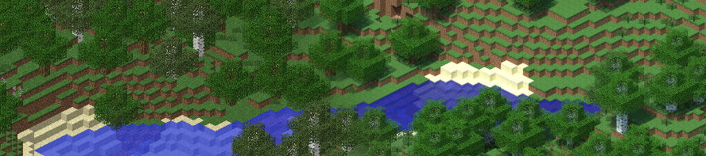

# ChunkyMap

ChunkyMap is a map renderer for [Dynmap][dynmap] that uses [Chunky][chunky] to render the map tiles. This combines photorealistic rendering with the convenience and automatic updates of Dynmap. ChunkyMap is implemented as a drop-in replacement for the `HDMap` that comes with Dynmap.



## Installation

1. Download the latest jar from [the releases page][latest-release] and put it in your plugins directory.
2. Edit `plugins/dynmap/worlds.txt` and change the `class` option from `org.dynmap.hdmap.HDMap` to `de.lemaik.chunkymap.dynmap.ChunkyMap` for all maps that you want to render with Chunky.  
   You can use any perspective and resolution for those maps ([list of available perspectives][dynmap-perspectives]).

   This example `worlds.txt` for a single map of a world called `world` might help you:

   ```yml
   worlds:
     - name: world
       maps:
         - class: de.lemaik.chunkymap.dynmap.ChunkyMap
           name: chunky
           title: World
           perspective: iso_SE_30_hires
   ```

3. Restart your server (_restart_ not reload).
4. Re-render the worlds you enabled the new renderer for by running the following command from the server console: `dynmap fullrender world` (replace `world` with the actual world name).
5. Wait for it… :hourglass:
6. Wait for it… :hourglass: (Sorry, rendering with Chunky takes a while, but it's worth it!)
7. Take a look at your new, shiny maps! :sparkles:

## Configuration

The maps can be configured by adding options to the map's section in the `world.txt` file.

| Option                           | Description                                                                                                                                                                                                                             | Default |
| -------------------------------- | --------------------------------------------------------------------------------------------------------------------------------------------------------------------------------------------------------------------------------------- | ------- |
| `samplesPerPixel`                | Samples per pixel that Chunky should render. More SPP improves the render quality but also increases render time.                                                                                                                       | 100     |
| `chunkyThreads`                  | Number of threads per Chunky instance. More threads will decrease render time but increase the CPU load of your server.                                                                                                                 | 2       |
| `chunkyCpuLoad`                  | Percentage of CPU time to use, per Chunky thread. Note that this only throttles the CPU usage during rendering, not during scene loading or post processing.                                                                            | 100     |
| ~~`texturepack`~~ (deprecated)   | Texturepack path, relative to `plugins/dynmap`. Use this option to specify a texturepack for a map. The texturepack in Dynmap's `configuration.txt` is ignored by ChunkyMap.                                                            | _None_  |
| `resourcepacks`                  | List of resourcepack paths, relative to `plugins/dynmap`. This also supports data packs for custom biomes. Use this option to specify resourcepacks for a map. The texturepack in Dynmap's `configuration.txt` is ignored by ChunkyMap. | _None_  |
| `chunkPadding`                   | Radius of additional chunks to be loaded around each chunk that is required to render a tile of the map. This can be used to reduce artifacts caused by shadows and reflections.                                                        | 0       |
| `requeueFailedTiles`             | Put tiles that failed to render back into the tile queue.                                                                                                                                                                               | true    |
| `templateScene`                  | Path to a Chunky scene file (JSON), relative to `plugins/dynmap`. Use this option to customize the scene that is used for rendering the tiles, e.g. to change the water color.                                                          | _None_  |
| `texturepackVersion`             | The Minecraft version that should be used as fallback textures                                                                                                                                                                          | 1.16.2  |
| `denoiser/enabled`               | Enable denoising using [Intel Open Image Denoise](https://openimagedenoise.github.io/). Only works on Linux                                                                                                                             | false   |
| `denoiser/albedoSamplesPerPixel` | Samples per pixel for the albedo map. Setting this to 0 will disable the albedo and normal map.                                                                                                                                         | 4       |
| `denoiser/normalSamplesPerPixel` | Samples per pixel for the normal map. Setting this to 0 will disable the normal map.                                                                                                                                                    | 4       |
| `chunkycloud/enabled`            | Render tiles using the Chunky Cloud render service                                                                                                                                                                                      | false   |
| `chunkycloud/apiKey`             | API Key for the Chunky Cloud render service                                                                                                                                                                                             |         |
| `chunkycloud/initializeLocally`  | Generate the octree locally. Less data to upload, faster render times but will use a lot of CPU locally.                                                                                                                                | true    |

:warning: A forward slash (`/`) in the option name means that the right part is a nested option and needs to be put into the next line and indented properly. Take a look at the examples below.

## Example configurations

### Simple map rendered with ChunkyMap

`plugins/dynmap/worlds.txt`:

```yml
worlds:
  - name: world
    maps:
      - class: de.lemaik.chunkymap.dynmap.ChunkyMap
        name: chunky
        title: Chunky
        perspective: iso_SE_30_hires
        chunkyThreads: 2
        samplesPerPixel: 20
        denoiser:
          enabled: true
          albedoSamplesPerPixel: 4
          normalSamplesPerPixel: 4
```

### Custom perspectives

Like the default dynmap renderer, ChunkyMap supports custom perspectives. As a starting point, you can use the built-in perspectives from `perspectives.txt` and customize them. More information on how to define custom perspectives can be found [in the corresponding Dynmap wiki article](https://github.com/webbukkit/dynmap/wiki/Defining-custom-perspectives).

The following example adds a maximum height to the nether world so that the dynmap doesn't only show the bedrock layer on top of it.

`plugins/dynmap/worlds.txt`:

```yml
worlds:
  - name: world_nether
    maps:
      - class: de.lemaik.chunkymap.dynmap.ChunkyMap
        name: chunky_nether
        title: Nether
        perspective: iso_SE_30_hires_nether
        chunkyThreads: 2
        samplesPerPixel: 20
```

`plugins/dynmap/custom-perspectives.txt`:

```yml
perspectives:
  - class: org.dynmap.hdmap.IsoHDPerspective
    name: iso_SE_30_hires_nether
    azimuth: 135
    inclination: 30
    scale: 16
    maximumheight: 100 # the bedrock layer is at 127
```

### Rendering ChunkyMap on ChunkyCloud

`plugins/dynmap/worlds.txt`:

```yml
worlds:
  - name: world
    maps:
      - class: de.lemaik.chunkymap.dynmap.ChunkyMap
        name: chunky
        title: Chunky
        perspective: iso_SE_30_hires
        samplesPerPixel: 20
        chunkycloud:
          enabled: true
          initializeLocally: false
          apiKey: your-secret-api-key
```

### Customizing the look of a map with template scenes

You can change how the map looks by providing a template scene. That can be any Chunky scene (`.json`) file or a partial scene file (i.e. a `.json` file that only contains the values that should be changed). ChunkyMap will import many scene options from the template scene, including the sun position, fog and water configuration.

The following example changes the default gray water color to blue.

`plugins/dynmap/worlds.txt`:

```yml
worlds:
  - name: world
    maps:
      - class: de.lemaik.chunkymap.dynmap.ChunkyMap
        name: chunky
        title: Chunky
        perspective: iso_SE_30_hires
        chunkyThreads: 2
        samplesPerPixel: 20
        templateScene: blueWater.json
```

`plugins/dynmap/blueWater.json`:

```json
{
  "useCustomWaterColor": true,
  "waterColor": {
    "red": 0.029,
    "green": 0.031,
    "blue": 0.16
  }
}
```

## Ceveats

- Rendering is pretty slow, but I'll improve this by rendering multiple tiles as one image in the future.
- ChunkyMap only works with Bukkit/Spigot at the moment. Supporting more servers would be awesome, though!

## Dynmaps that use this plugin

- Craften Server: [Lobby Dynmap](https://play.craften.de/maps/index.html?worldname=world&mapname=rs&zoom=5&x=594&y=64&z=-420)
- Greenfield City Minecraft: [Greenfield Dynmap](http://map.greenfieldmc.net/?worldname=world&mapname=chunky&zoom=5)
- _Using ChunkyMap on your server? Submit a PR to get it on this list._

## Building ChunkyMap

1. Get the latest version of [Chunky 2][chunky]. After updating, you'll find the jar file in `~/.chunky/lib` (Linux/Mac) or `%APPDATA%\.chunky\lib` (Windows). Copy the `chunky-core-<version>.jar` file into the root directory of this repository and rename it to `chunky.jar`.
2. Run `mvn install` to install all other dependencies. Chunky 2 can't be installed this way because it's not yet in the Maven repository.
3. Run `mvn clean package`, the plugin jar will be in the `target` directory.

Note: To fix some concurrency issues that don't occur when using Chunky in standalone mode and aren't yet merged into Chunky, this plugin is built against [this Chunky branch](https://github.com/leMaik/chunky/tree/remove-static-registries) instead.

## Copyright & License

ChunkyMap is Copyright 2016–2020 Maik Marschner (leMaik)

Permission to modify and redistribute is granted under the terms of the GNU General Public License, Version 3. See the `LICENSE` file for the full license.

ChunkyMap uses the following third-party libraries:

- **Chunky by Jesper Öqvist**  
  Chunky is covered by the GNU General Public License, Version 3. See the license file in `licenses/gpl-3.txt`.
- **Commons Math by the Apache Software Foundation**  
  Commons Math is covered by The Apache Software License, Version 2.0. See the license file in `licenses/commons-math.txt`.
- **DynmapCore by mikeprimm**  
  DynmapCore is covered by The Apache Software License, Version 2.0. See the license file in `licenses/apache-2.txt`.
- **Gson by Google**  
  Gson is covered by The Apache Software License, Version 2.0. See the license file in `licenses/apache-2.txt`.
- **OkHttp by Square**  
  OkHttp is covered by The Apache Software License, Version 2.0. See the license file in `licenses/apache-2.txt`.

## Trivia

Originally, ChunkyMap was created as a demo for the [RenderService][rs3]. This service allows rendering the tiles on a distributed network of renderers, which is often faster than rendering the tiles locally.

Ironically, I then implemented support for local tile rendering and removed support for using the RenderService. It will come back in the future.

[dynmap]: http://www.minecraftforum.net/forums/mapping-and-modding/minecraft-mods/1286593-dynmap
[chunky]: https://chunky.lemaik.de/
[latest-release]: https://github.com/leMaik/ChunkyMap/releases/latest
[rs3]: https://bitbucket.org/account/user/wertarbyte/projects/RS
[dynmap-perspectives]: https://github.com/webbukkit/dynmap/wiki/Full-list-of-predefined-perspectives
